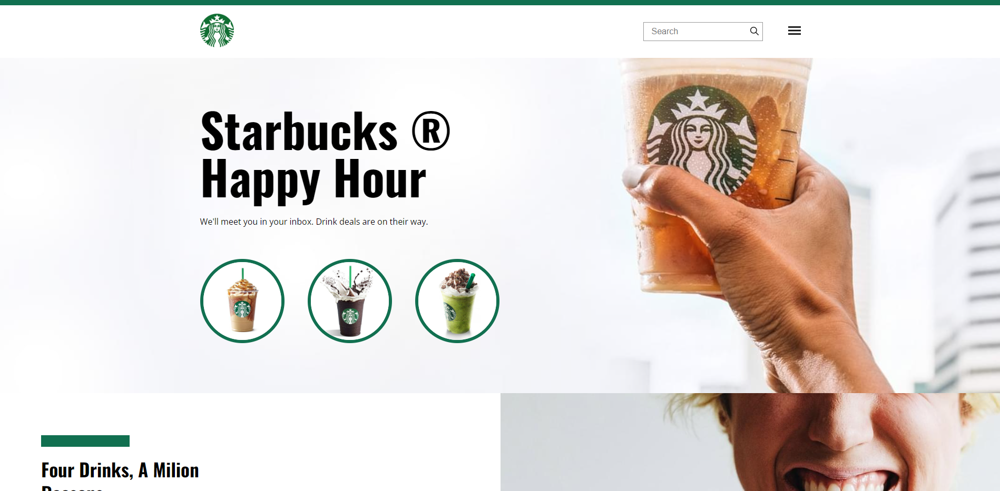

<h1 align="center">Starbucks</h1>

 

<kbd>

 

>Exercício

Projeto: Reconstrução de um layout em HTML/CSS. 
Layout responsivo. 
Feito junto com o professor.

[Clique aqui para acessar o site.](https://scgui.github.io/Starbucks/)

## Tecnologias

- HTML
- CSS
- Git e Github

## Comentários

- Prática com css grid.

## Contato

guics37.go@gmail.com
